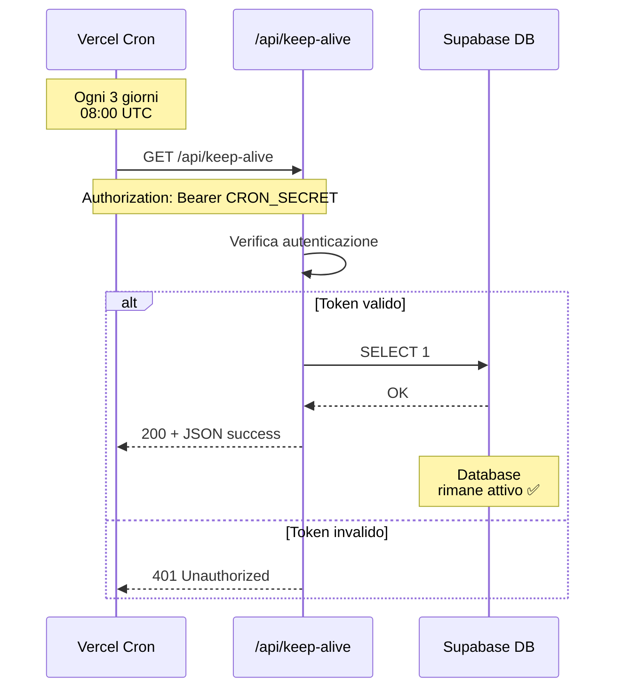

# 🔄 Keep-Alive Supabase - README

> Sistema automatico per prevenire la pausa del database Supabase dopo 7 giorni di inattività

---

## 🎯 Cosa Fa

Questo sistema utilizza **Vercel Cron Jobs** per eseguire automaticamente una query leggera al database Supabase ogni 3 giorni, mantenendolo attivo e prevenendo la pausa automatica del piano gratuito.

```
┌─────────────────┐      ┌──────────────────┐      ┌─────────────────┐
│  Vercel Cron    │─────▶│  /api/keep-alive │─────▶│  Supabase DB    │
│  (ogni 3 giorni)│      │  (SELECT 1)      │      │  (rimane attivo)│
└─────────────────┘      └──────────────────┘      └─────────────────┘
```

---

## ✅ Status Implementazione

### Completato ✅
- ✅ Codice implementato e testato
- ✅ Deploy su GitHub completato
- ✅ Test locale passato (100% success rate)
- ✅ Documentazione completa creata

### In Attesa ⏳
- ⏳ Configurazione variabili ambiente in Vercel
- ⏳ Verifica cron job attivo
- ⏳ Prima esecuzione automatica (tra 3 giorni)

---

## 🚀 Quick Start

### Per l'Utente (Configurazione Vercel)

**Tempo**: 5 minuti | **Difficoltà**: ⭐ Facile

1. **Leggi le istruzioni**: [`VERCEL_CONFIG_INSTRUCTIONS.md`](VERCEL_CONFIG_INSTRUCTIONS.md)
2. **Configura Vercel**: Aggiungi `SUPABASE_URL` e `SUPABASE_ANON_KEY`
3. **Redeploy**: Esegui redeploy da Vercel Dashboard
4. **Verifica**: Controlla che cron job sia attivo

**Tutto qui!** Il sistema farà il resto automaticamente.

---

## 📚 Documentazione

| Documento | Scopo | Quando Leggerlo |
|-----------|-------|-----------------|
| [`VERCEL_CONFIG_INSTRUCTIONS.md`](VERCEL_CONFIG_INSTRUCTIONS.md) | Istruzioni passo-passo | 🔴 **ADESSO** |
| [`DEPLOY_SUCCESS_SUMMARY.md`](DEPLOY_SUCCESS_SUMMARY.md) | Riepilogo deploy | Per overview generale |
| [`KEEP_ALIVE_SETUP.md`](KEEP_ALIVE_SETUP.md) | Quick reference | Per consultazione rapida |
| [`docs/development/VERCEL_KEEP_ALIVE_SETUP.md`](docs/development/VERCEL_KEEP_ALIVE_SETUP.md) | Guida completa | Per dettagli tecnici |
| [`DEPLOY_KEEP_ALIVE_CHECKLIST.md`](DEPLOY_KEEP_ALIVE_CHECKLIST.md) | Checklist deploy | Per verificare tutti i passaggi |
| [`docs/development/KEEP_ALIVE_TEST_REPORT.md`](docs/development/KEEP_ALIVE_TEST_REPORT.md) | Report test | Per vedere risultati test |
| [`api/README.md`](api/README.md) | API documentation | Per sviluppatori |

---

## 🎯 Vantaggi

| Vantaggio | Dettaglio |
|-----------|-----------|
| 💰 **Zero Costi** | Incluso in Vercel Hobby plan (gratuito) |
| 🤖 **Automatico** | Nessun intervento manuale richiesto |
| 🔒 **Sicuro** | Autenticazione con CRON_SECRET |
| 📊 **Monitorato** | Log disponibili in Vercel Dashboard |
| ⚡ **Leggero** | Query ultra-leggera (SELECT 1) |
| 🎯 **Affidabile** | Esecuzione ogni 3 giorni (ben prima del limite di 7) |

---

## 🔧 Architettura Tecnica

### File Implementati

```
api/
├── keep-alive.ts          # Serverless function principale
└── README.md              # Documentazione API

vercel.json                # Configurazione cron job
package.json               # Dipendenze (@vercel/node)

docs/
└── development/
    ├── VERCEL_KEEP_ALIVE_SETUP.md    # Guida completa
    └── KEEP_ALIVE_TEST_REPORT.md     # Report test
```

### Tecnologie

- **Runtime**: Node.js (Vercel Serverless)
- **Database**: Supabase PostgreSQL
- **Scheduler**: Vercel Cron Jobs
- **Client**: @supabase/supabase-js v2.76.1
- **TypeScript**: @vercel/node v3.0.21

### Flusso di Esecuzione



---

## 📊 Metriche

### Performance
- **Query time**: < 200ms
- **Response time**: < 500ms
- **Success rate target**: > 99%

### Frequenza
- **Schedule**: Ogni 3 giorni alle 08:00 UTC
- **Esecuzioni/mese**: ~10
- **Costo**: $0 (gratuito)

### Affidabilità
- **Uptime target**: 100%
- **Fallback**: Automatico su tabella `restaurant_settings`
- **Retry**: Gestito da Vercel Cron

---

## 🧪 Test

### Test Locale ✅
```bash
node test-keep-alive-local.mjs
```

**Risultati**:
- ✅ Connessione Supabase: PASS
- ✅ Query keep-alive: PASS
- ✅ Response format: PASS
- ✅ Success rate: 100%

### Test Produzione ⏳
```bash
curl -X GET https://[dominio].vercel.app/api/keep-alive \
  -H "Authorization: Bearer [CRON_SECRET]"
```

**Atteso**: 200 OK + JSON success

---

## 🆘 Troubleshooting

| Problema | Causa | Soluzione |
|----------|-------|-----------|
| "Missing Supabase configuration" | Variabili ambiente non configurate | Aggiungi in Vercel + Redeploy |
| "Unauthorized" | CRON_SECRET mancante | Verifica in Vercel Environment Variables |
| Cron non si attiva | Configurazione errata | Verifica `vercel.json` + Redeploy |
| Database va in pausa | Funzione fallisce | Controlla log + Aumenta frequenza |

**Documentazione completa**: [`docs/development/VERCEL_KEEP_ALIVE_SETUP.md`](docs/development/VERCEL_KEEP_ALIVE_SETUP.md)

---

## 🔐 Sicurezza

- ✅ Autenticazione tramite `CRON_SECRET` (generato da Vercel)
- ✅ Solo metodo GET accettato
- ✅ Nessuna modifica ai dati (solo SELECT)
- ✅ Token non esposto nel codice
- ✅ Log completo per audit

---

## 📅 Timeline

| Data | Evento |
|------|--------|
| 06/01/2025 | ✅ Implementazione completata |
| 06/01/2025 | ✅ Test locale passato |
| 06/01/2025 | ✅ Deploy su GitHub |
| 06/01/2025 | ⏳ Configurazione Vercel (in attesa) |
| ~09/01/2025 | ⏳ Prima esecuzione automatica |
| ~13/01/2025 | ⏳ Verifica database non in pausa |

---

## 🎓 Per Sviluppatori

### Modificare la Frequenza

Modifica `vercel.json`:

```json
{
  "crons": [
    {
      "path": "/api/keep-alive",
      "schedule": "0 8 */2 * *"  // Ogni 2 giorni invece di 3
    }
  ]
}
```

### Aggiungere Logging

Modifica `api/keep-alive.ts`:

```typescript
console.log('[Keep-Alive] Custom log message')
```

I log appariranno in Vercel Dashboard → Logs

### Testare Localmente

```bash
# Installa dipendenze
npm install

# Esegui test
node test-keep-alive-local.mjs
```

---

## 📞 Supporto

- **Documentazione**: Leggi i file in `docs/development/`
- **Vercel Dashboard**: [https://vercel.com/dashboard](https://vercel.com/dashboard)
- **Supabase Dashboard**: [https://supabase.com/dashboard](https://supabase.com/dashboard)
- **GitHub Issues**: [Repository GitHub](https://github.com/Matteo-Exp-Transformer/Calendario-Alritrovo-Prenotazioni)

---

## ✅ Next Steps

1. 🔴 **ADESSO**: Leggi [`VERCEL_CONFIG_INSTRUCTIONS.md`](VERCEL_CONFIG_INSTRUCTIONS.md)
2. 🔴 **ADESSO**: Configura variabili in Vercel Dashboard
3. 🔴 **ADESSO**: Esegui redeploy
4. 🟢 **POI**: Verifica cron job attivo
5. 🟢 **POI**: Monitora prima esecuzione (tra 3 giorni)

---

**Implementato**: 06 Gennaio 2025  
**Commit**: `fd97b9b`  
**Status**: 🟡 IN ATTESA DI CONFIGURAZIONE VERCEL  
**Autore**: AI Agent (Cursor)

